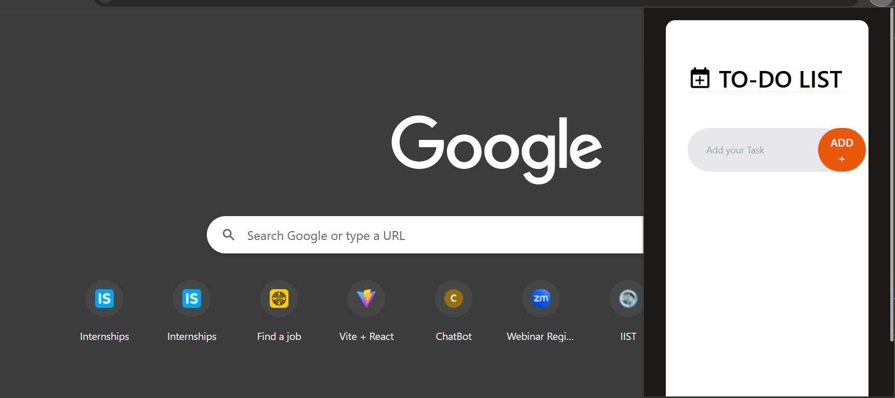
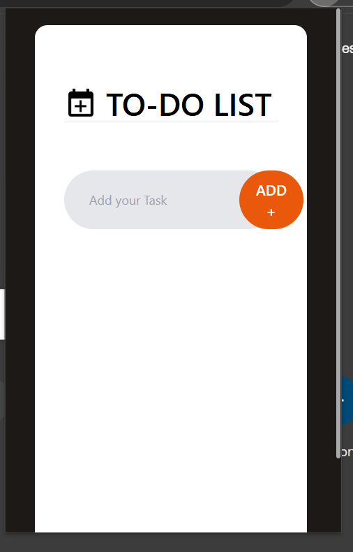
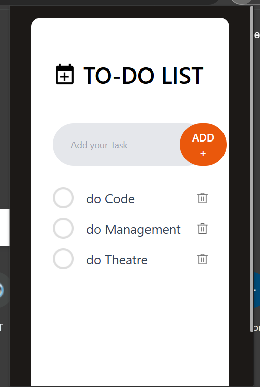
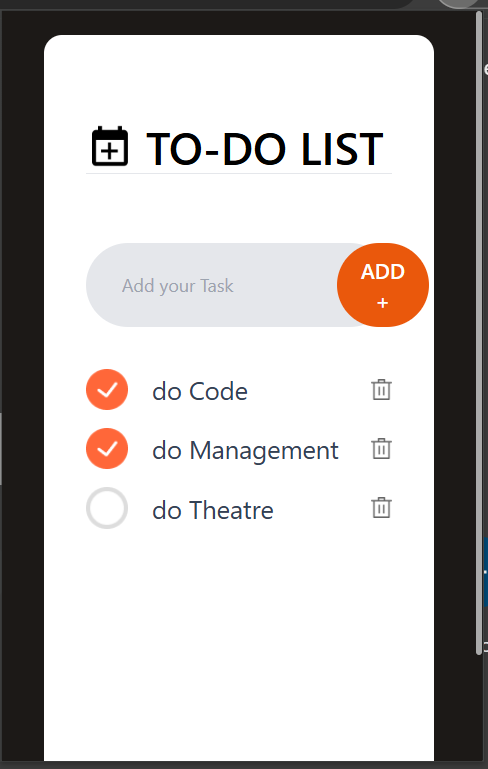

# TODO-App_Web_Extension
A minimal, responsive Todo List Chrome Extension built with React, Tailwind CSS, and Vite. This extension allows users to manage daily tasks directly from their browser toolbar — no need to open a new tab or app.

## 📸 Screenshots

Here’s a quick preview of the Chrome Extension Todo App:

### 🔹 Todo List UI



### 🔹 Add Task / Remove Task Demo



<h1 align="center">📝 Chrome Extension: React Todo App</h1>

<p align="center">
  A lightweight and responsive Chrome Extension built with <strong>React</strong>, <strong>Tailwind CSS</strong>, and <strong>Vite</strong>, designed to help you manage daily tasks without leaving your browser.
</p>

<p align="center">
  
</p>

---

## 📌 Overview

This project transforms a simple React Todo List into a fully functional **Chrome Extension** using **Manifest v3**. It's built for speed, simplicity, and user experience — allowing users to manage tasks directly from their Chrome toolbar popup.

---

## ✨ Features

- 🧠 Add and remove todos with one click
- 🕒 Auto-save todos in `localStorage`
- 🚀 Optimized build with **Vite**
- 🎨 Styled beautifully with **Tailwind CSS**
- 🧩 Packaged for Chrome as an **MV3 Extension**
- 💻 Clean, mobile-responsive UI

---

## 🛠️ Tech Stack

| Technology     | Role                      |
|----------------|---------------------------|
| React          | UI development            |
| Vite           | Fast bundler & build tool |
| Tailwind CSS   | Styling                   |
| LocalStorage   | Persistent data storage   |
| Manifest v3    | Chrome extension setup    |

---

## 📦 Getting Started

### 🔧 Local Development

```bash
git clone https://github.com/pani-03/TODO-App_Web_Extension.git
cd TODO-App_Web_Extension
npm install
npm run dev
⚙️ Production Build
bash
Copy
Edit
npm run build
This will create a /dist folder with everything ready for Chrome.

🧩 Load as Chrome Extension
Go to: chrome://extensions

Enable Developer Mode

Click Load Unpacked

Select the /dist folder

You’ll see the extension appear in your browser’s toolbar 🎉

📸 Screenshots
Preview of the extension and UI states:

🪟 Extension Popup UI


➕ Adding & Removing Tasks


🧠 Why I Built This
"I wanted to go beyond regular React apps by turning one into a fully packaged Chrome Extension. This project challenged me to integrate modern tooling (Vite + Tailwind) while applying concepts like persistent state, manifest configuration, and browser-based UX."

🙋‍♂️ About Me
Shubham Pani
🌐 Frontend Developer | React Enthusiast
📍 Based in Jamshedpur, India
🔗 GitHub | LinkedIn
